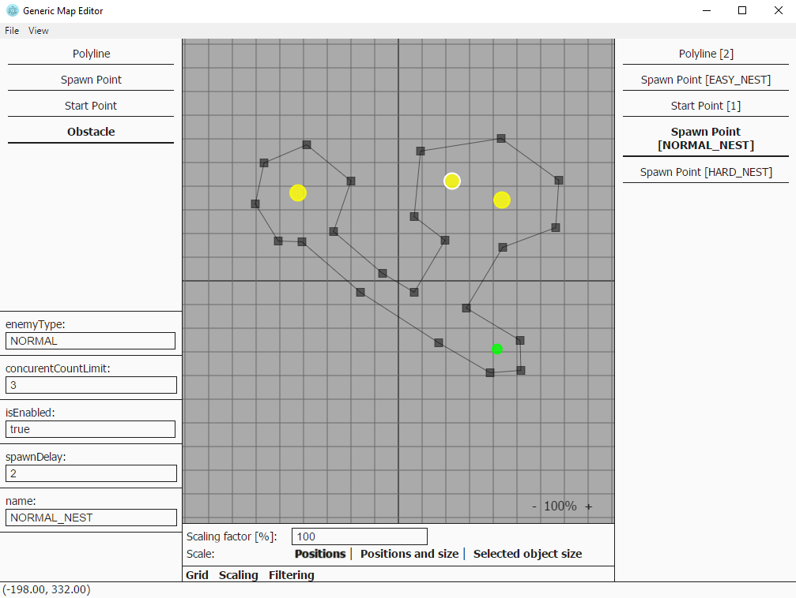

# Universal Map Editor

#### About the project

I started developing this project during development of Cocos2DX-based game.
Unfortunately I haven't found any simple and easily extensible 2D non-tile based map editor, so I created this one.

#### How to start

The idea is to have a metadata file that describes the objects available in the game, based on which the editor can run. The editor uses JSON as the map format. It also includes Lua editor for scripts.

The metadata file is written in JavaScript (as the editor), so you will have to know it a bit to write your own specification (but only a little).
Sample object description:

```
{
	type: 'SPAWN_POINT',
	label: 'Spawn Point',
	// Properties of the object.
	properties: me.utils.mixin({}, commonProperties, {
		'enemyType': { type: 'enum', values: [ 'EASY', 'NORMAL', 'HARD' ], default: 0 },
		'concurentCountLimit': { type: 'int', min: 1, max: 255, default: 3 },
		'isEnabled': { type: 'bool', default: true },
		'spawnDelay': { type: 'float', min: 0.1, default: 2 }
	}),
	// Render method for the object.
	render: function(ctx, selected) {
		(... optional render code ...)
	},
	// Used for handling click events.
	contains: function(x, y) {
		return Math.pow(x - this.x, 2) + Math.pow(y - this.y, 2) < Math.pow(24, 2);
	}
}
```

When you run the app for the first time you'll most likely see an error stating that the metadata file is not found. It should be placed next to the universal-map-editor directory. Sample metadata file (and also sample level) can be found in universal-map-editor/sample/ directory.

#### How to run

This project uses [electron](https://electron.atom.io/).
To run it simply execute `npm install` and then `npm start`

#### How to use

<div align="center" style="padding: 5px"></div>

Editor is quite easy to use.
On the top left you can see a palette of available objects.
On the right you can see a list of already placed objects.
On the bottom left you can see the properties of currently focused object.

The *Export* button by default does not yield different results than the *Save* button, unless you have specified *compile* method for an object (for example Polyline has one).

Few tips and tricks:

* You can remove focused object by pressing Delete key.
* You can move the map viewport by dragging it.
* Holding Shift while clicking the map will force placing an object on the map. This is useful when you want to have overlapping objects.
* Clicking on a position where multiple objects overlap, will cycle focus through those objects.
* The properties of a currently focused object will get carried over to a newly placed object, if it is of the same type. This is useful when you need to create a bunch of objects with the same properties.


#### Metadata specification

This section is in progress as I want to have a decent tutorial here.
But if you are fluent in JavaScript, you can have a look at [map_objects.js](https://github.com/sulewicz/universal-map-editor/blob/master/js/map_objects.js) and [map_shapes.js](https://github.com/sulewicz/universal-map-editor/blob/master/js/map_objects.js) to see what properties are available.
